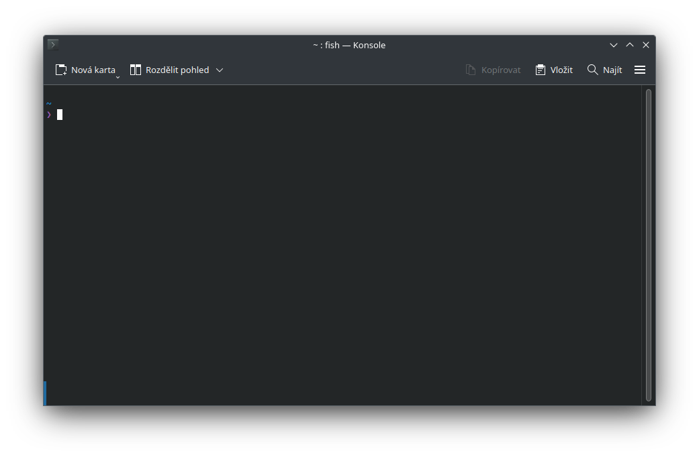

# Úvod do Terminálu
## Co to je Terminál?
Terminál je okno, které umožňuje pomocí příkazů ovládat počítač.

## Hlavní vlastnosti Terminálu
1. **Rychlý a přímý**: V terminálu lze efektivně spravovat soubory a instalovat programy pomocí textových příkazů.
2. **Automatizace a usnadnění práce**: Umožňuje automatizovat opakované úkoly pomocí skriptů a tím šetřit čas.
3. **Přizpůsobitelnost**: Terminál lze upravit dle svých představ - změnit vzhled, přidat funkce nebo vytvořit vlastní příkazy.
4. **Učení a rozvoj**: Práce s terminálem umožňuje lepší pochopení, jak počítač funguje.

## Jak Terminál vypadá?
Terminál může vypadat různě, každá Linux distribuce ho má upravený dle sebe.

### Konsole
- [Stránky Konsole](https://konsole.kde.org/)
- [Zdrojový kód Konsole](https://invent.kde.org/utilities/konsole)
- [Wikipedie](https://cs.wikipedia.org/wiki/Konsole)

